

<!-- PROJECT SHIELDS -->
[![Contributors][contributors-shield]][contributors-url]
[![Forks][forks-shield]][forks-url]
[![Stargazers][stars-shield]][stars-url]
[![Issues][issues-shield]][issues-url]
[![LinkedIn][linkedin-shield]][linkedin-url1]
[![LinkedIn][linkedin-shield]][linkedin-url2]

<!-- PROJECT LOGO -->
### Datapath Diagram
 

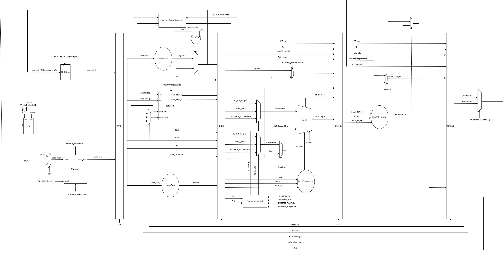

<h3 align="center">RISC-V Pipelined Processor Implementation</h3>

  

<!--     <a href="https://github.com/MohamedRagabAbbas/RISC-V-Pipelined-Processor">View Demo</a> -->
<!--     · -->
    <a href="https://github.com/MohamedRagabAbbas/RISC-V-Pipelined-Processor/issues">Report Bug</a>
    ·
    <a href="https://github.com/MohamedRagabAbbas/RISC-V-Pipelined-Processor/issues">Request Feature</a>
  

<!-- ABOUT THE PROJECT -->

# RISC-V Pipelined Processor

## Introduction

In this project, we implemented a 5-stage pipelined RV32 processor supporting all 40 RISC-V instructions as well as multiplication and division instructions according to the provided specification document. Unlike the previous milestone, we integrated a single memory for both data and instructions.

## Architecture

### Stages

- **First Stage (IF)**: Instruction fetch.
- **Second Stage (ID)**: Instruction Decode.
- **Third Stage (EX)**: Execution.
- **Fourth Stage (MEM)**: Memory.
- **Fifth Stage (WB)**: Write back.

## Implementation

### Pipelining

We added pipeline registers between each stage (IF/ID, ID/EX, EX/MEM, MEM/WB) to introduce pipelining. Each pipeline register carries propagated bits from the previous stage which may be required in the current or subsequent stages.

### Forwarding

To handle data hazards, particularly RAW hazards introduced by pipelining, we implemented a forwarding unit. This unit checks during the decoding phase if a source register of the current instruction is a destination register in one of the previous two instructions. If so, the result is forwarded to prevent data hazards.

### Hazard Detection

We implemented a hazard detection unit to handle load-use hazards, which occur when an instruction depends on data from a memory load that hasn't finished yet. The unit detects such hazards and stalls the pipeline to prevent incorrect data dependencies.

### Instruction Flushing

We introduced a mechanism to flush unnecessary instructions in scenarios affecting the Program Counter (PC) in the pipeline, such as branches or specific instructions like Fence and ECALL. This mechanism prevents incorrect instructions from proceeding further in the pipeline.

### Single Memory

We incorporated a byte-addressable single-ported memory for both data and instructions. Random instructions were generated using an instruction generator, converted to binary, and compared against the outputs of an actual simulator for validation.

## Testing

Thorough testing was conducted for each instruction individually and in various combinations using an instruction generator. Test cases covered a wide range of scenarios to ensure the correctness and robustness of the implementation.

### Testing R-type & I-type & B-type Instructions

The R-type & I-type & B-type instructions were tested extensively to verify their functionality. Below are the images showcasing the simulation results for different R-type & I-type & B-type instructions:

  

    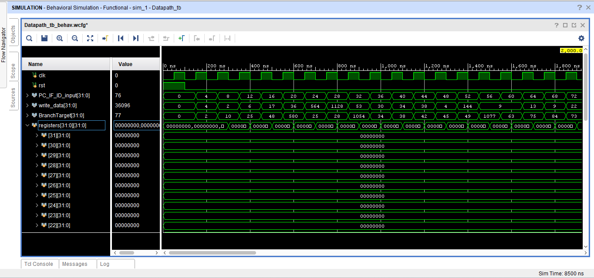
  

  

    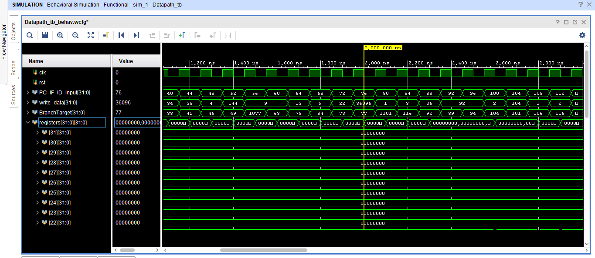
  

  

    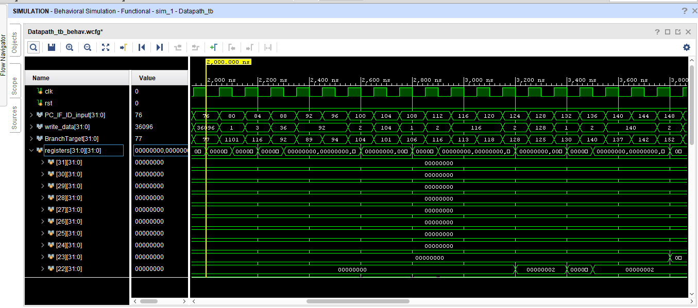
  

  

    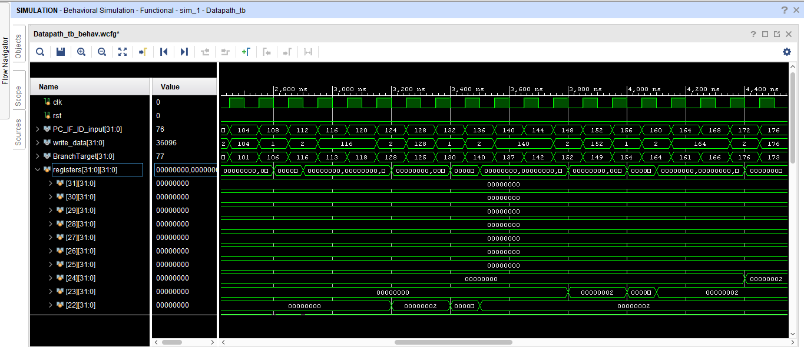
  

  

    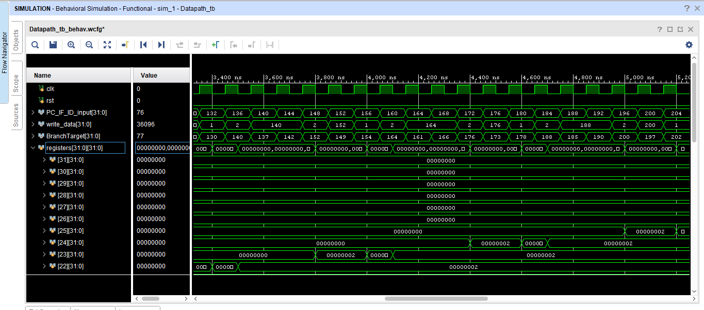
  

  

    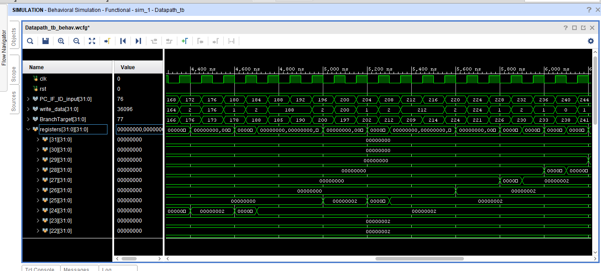
  

  

    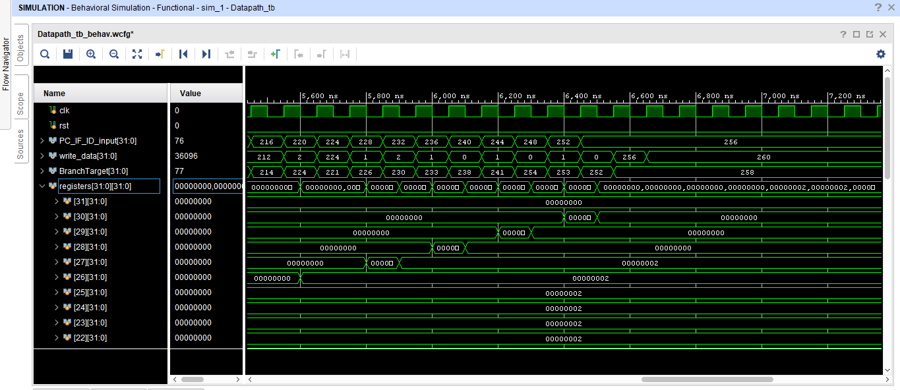
  

  

    
  

### Testing S-type & L-type  Instructions

Similarly, the S-type & L-type instructions underwent thorough testing. Here are the simulation results for some of the S-type & L-type instructions:

  

    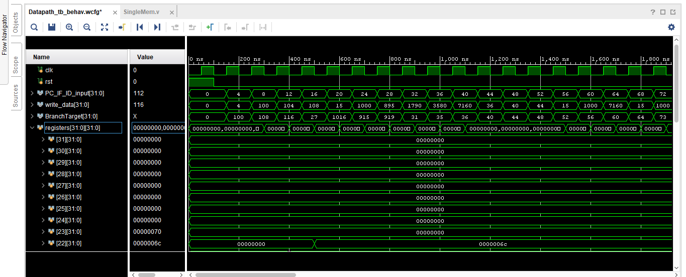
  

  

    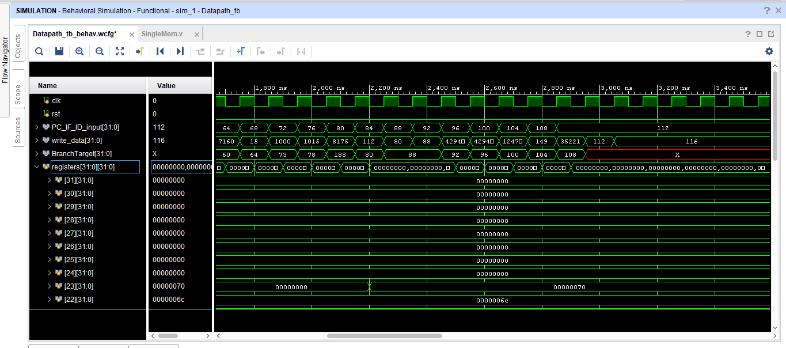
  

### Testing JAL, JALR, LUI, and AUIPC Instructions

The jump and immediate instructions were specifically tested to verify their proper functioning:

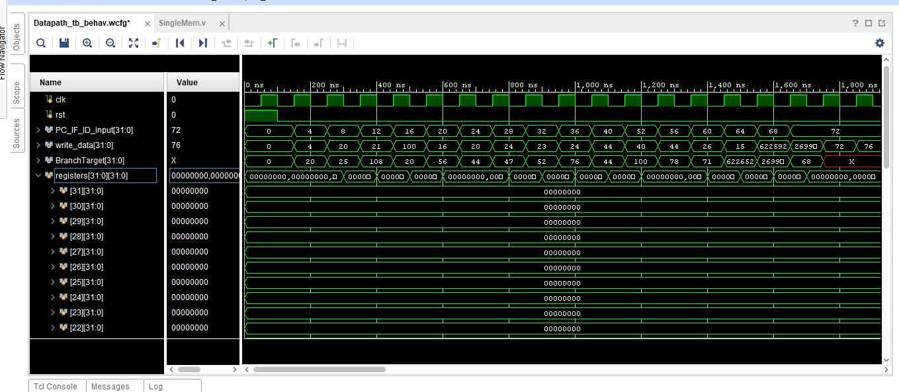

### Testing MUL, DIV, REM Instructions

The multiplication, division, and remainder instructions were also subjected to rigorous testing:

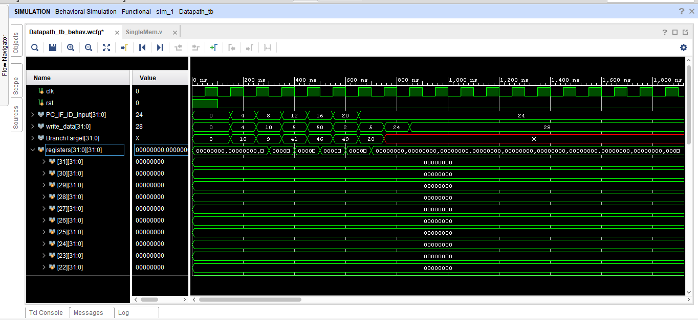

## Bonus Features

### RV32IM Support

Support for integer multiplication and division was added to effectively support the full RV32IM instruction set.

### Test Program Generator

A test program generator capable of generating a sequence of random valid instructions was implemented to facilitate comprehensive testing of the processor implementation.

## Building the Project
1. Download `RISC-V-Pipelined-Processor` Folder.
2. Open Vivado.
3. Create New Project.
4. Add  `RISC-V-Pipelined-Processor` Folder to the project through `Add directory` button.

## Tech Stack

The project utilizes the following technologies:

<!-- MARKDOWN LINKS & IMAGES -->
[contributors-shield]: https://img.shields.io/github/contributors/youssef-mansor/RISC-V-Datapath-single-cycle-implementation.svg?style=for-the-badge
[contributors-url]: https://github.com/MohamedRagabAbbas/RISC-V-Pipelined-Processor/graphs/contributors
[forks-shield]: https://img.shields.io/github/forks/MohamedRagabAbbas/RISC-V-Pipelined-Processor.svg?style=for-the-badge
[forks-url]: https://github.com/MohamedRagabAbbas/RISC-V-Pipelined-Processor/network/members
[stars-shield]: https://img.shields.io/github/stars/MohamedRagabAbbas/RISC-V-Pipelined-Processor.svg?style=for-the-badge
[stars-url]: https://github.com/MohamedRagabAbbas/RISC-V-Pipelined-Processor/stargazers
[issues-shield]: https://img.shields.io/github/issues/MohamedRagabAbbas/RISC-V-Pipelined-Processor.svg?style=for-the-badge
[issues-url]: https://github.com/MohamedRagabAbbas/RISC-V-Pipelined-Processor/issues
[license-shield]: https://img.shields.io/github/license/MohamedRagabAbbas/RISC-V-Pipelined-Processor.svg?style=for-the-badge
[license-url]: https://github.com/MohamedRagabAbbas/RISC-V-Pipelined-Processor/blob/main/LICENSE
[linkedin-shield]: https://img.shields.io/badge/-LinkedIn-black.svg?style=for-the-badge&logo=linkedin&colorB=555
[linkedin-url1]: https://www.linkedin.com/in/mohamed-ragab-773b86244/
[linkedin-url2]: https://www.linkedin.com/in/omar-bahgat-644ab1207/
[product-screenshot]: images/screenshot.png

